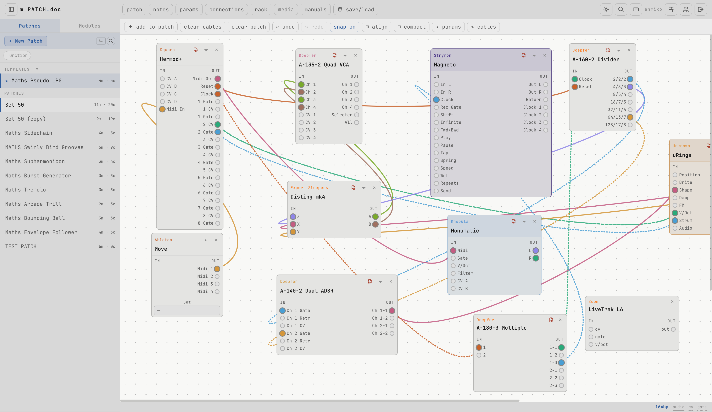
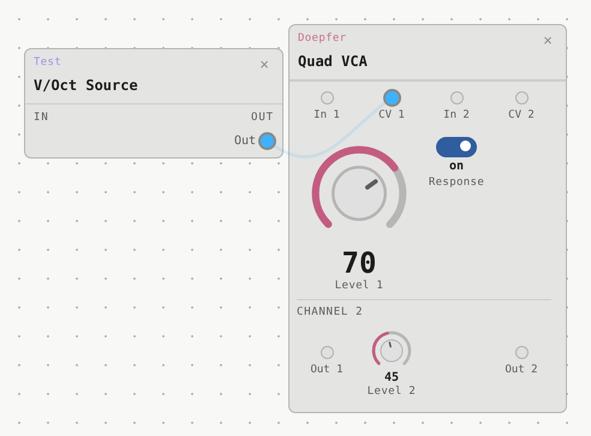
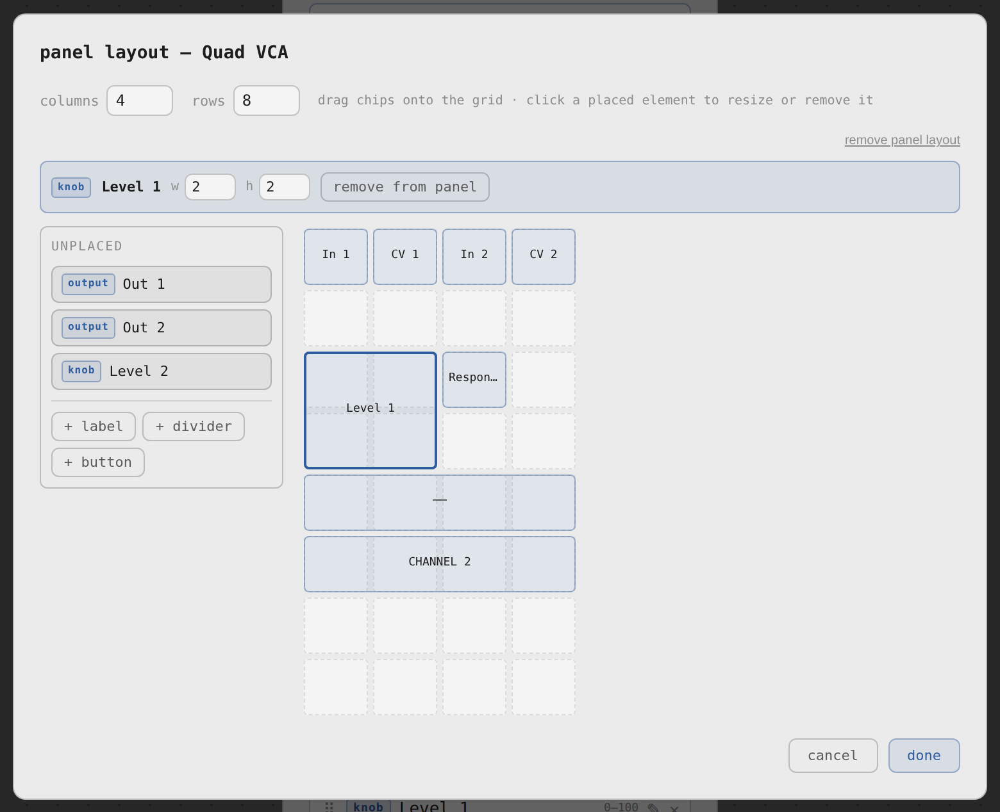
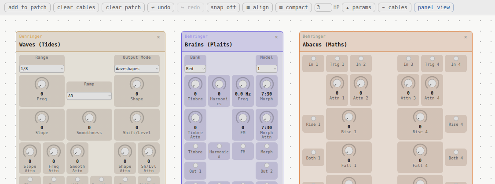
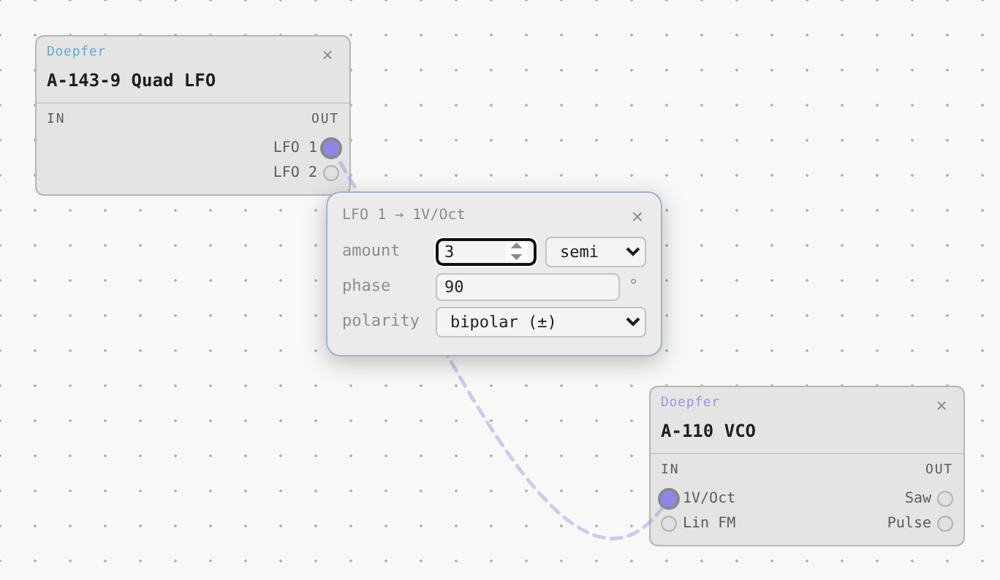
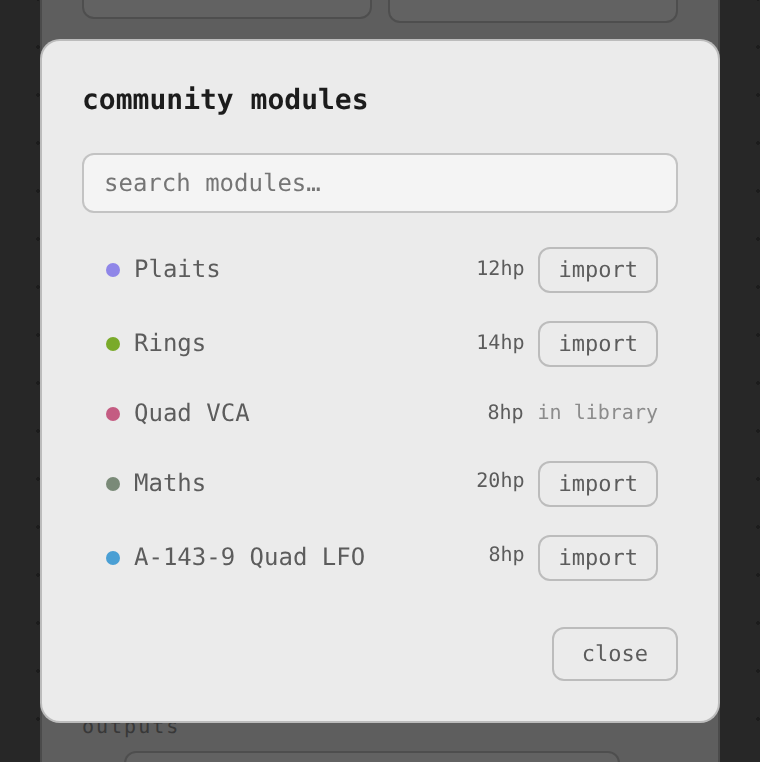
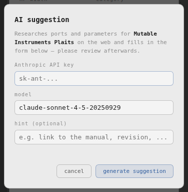
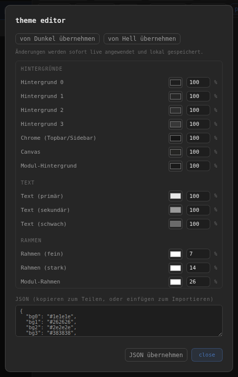

# ◉ PATCH.doc

**Eurorack patch documentation — self-hosted, multi-user, Docker-based.**

PATCH.doc is a web app for documenting modular synthesizer patches. It runs as a Docker container on your own hardware (NAS, home server, VPS) and is accessible from any browser or mobile device.

**→ [Try it instantly in your browser](https://hendrik-haehner.github.io/patch.doc/)** — no install, no account, runs entirely client-side. See [Three ways to run this](#three-ways-to-run-this) for what that version does and doesn't do compared to self-hosting or the desktop app.



---

## A note on this project

This app was created with the help of Claude (Anthropic). I myself have only fundamental coding skills — I was simply looking for a solution to my own problem and built this along the way. I hope it can be useful to others as well.

---

## Features

- **Patch canvas** — visual layout of modules with cables and connections
- **Panel layout** — optional front-panel-style view per module, with a visual editor to place ports, knobs, switches, labels and dividers on a grid (see [below](#panel-layout))
- **Connections tab** — dropdown-based cable editor, works on mobile without drag gestures
- **Modulation details** — document amount, phase and polarity per cable (e.g. an LFO into a CV input); such a cable renders dashed on the canvas, click or hover it to view/edit (see [below](#modulation-details))
- **Parameters** — document knob positions, switches and settings per module
- **Performance marks** — color-mark parameters (green / yellow / red) for live performance reference
- **Notes** — freetext notes per patch
- **Media** — attach photos and audio recordings to patches
- **Manuals** — upload PDF manuals per module (shared across all users)
- **Community modules** — browse and import module definitions shared by other users, in every version (browser, desktop, self-hosted); export your own as JSON from the export tab to contribute one back (see [below](#community-modules))
- **AI module draft** — bring your own Anthropic API key and have a Claude model research a real module's ports and parameters, pre-filling the add-module form (see [below](#ai-module-draft))
- **PDF export** — print-ready patch documentation (canvas + parameters + connections)
- **Global module search** — find which patches use a specific module (Cmd+F)
- **Templates** — mark patches as templates and create new patches from them
- **Rack layout** — pack modules tightly into rows with a defined HP gap, like a real case (see [below](#panel-layout))
- **Shared patches** — share patches between users via a common pool
- **Dark / Light theme** — follows OS preference, manually toggleable; or design your own in the theme editor (see [below](#theme-editor))
- **Mobile-optimized** — responsive touch UI with hamburger menu and patch dropdown
- **PWA** — installable as a home screen app on iOS and Android
- **Multi-user** — each user has their own patches and media; modules and manuals are shared
- **Admin panel** — manage users at `/admin` without restarting the container

---

## Panel layout

Any module can optionally render as a scaled front-panel mockup instead of a plain list — ports and controls sit roughly where they do on the real hardware, cables cross the panel translucently so they don't hide anything underneath, and a knob can span multiple cells to stand out.



Turn it on per-module from the module editor's **edit panel layout** button: drag ports, knobs, switches, labels and dividers onto a grid, resize anything by cell, and reposition by drag. It only arranges what's already defined on the module — inputs, outputs and parameters are still added the usual way.



Panel view is a display option, toggleable at any time from the patch toolbar (**panel view** / **list view**) — modules without a panel layout always render as a list either way.

Combined with **compact** in the patch toolbar, panel view turns into a rack layout: it packs every module tightly into rows, in real front-panel widths, spaced by the gap you set (in HP) next to the button. Because module heights differ, rows won't line up perfectly on the bottom edge — that's expected, same as a real case with mixed-height modules. Build a rack this way, mark it as a template, and **new patch from template** gives you the same physical layout to wire up differently each time.



---

## Modulation details

Cables can carry more than just "connected" — click any cable to document its amount, phase and polarity (e.g. how deep an LFO modulates a filter's cutoff, and in which direction). A cable with these set renders dashed on the canvas so it stands out at a glance; hover it for a quick read-only preview, click to edit.

Amount has its own unit, picked per cable — a bare percentage doesn't mean much without knowing what 100% is, and that's different for an exponential (1V/oct) pitch input than for a linear FM input. Choose from `%`, semitones, quartertones, octaves, Hz or V; the app guesses a sensible starting unit from the destination port's name (e.g. "1V/Oct" suggests semitones, "FM" suggests Hz), always overridable.



Deleting a cable no longer happens by clicking it — select it this way, then use **delete cable** in the patch toolbar.

---

## Community modules

Browse and import module definitions shared by other PATCH.doc users, from the module editor's **browse module repo** button — works the same in the browser, desktop, and self-hosted versions, no account needed. Modules already in your library are marked instead of offering an import button, so you can't double up.



The shared library lives in its own repo, [patchdoc-modules](https://github.com/hendrik-haehner/patchdoc-modules) — export any of your own modules as JSON from the **export** tab to contribute one back.

---

## AI module draft

Don't want to type out every jack and knob by hand? Fill in manufacturer + name in the add-module form, then hit **✨ AI-Vorschlag** next to **browse module repo**. With your own [Anthropic API key](https://console.anthropic.com/settings/keys) (entered once, stored only in that browser — never sent anywhere but `api.anthropic.com`, never synced), a Claude model searches the web for the module's real manual and pre-fills inputs, outputs and parameters from it.



It's a draft, not an oracle — always check the result against the manual before saving, and treat it the same way you would a first pass someone else handed you. It deliberately doesn't touch the front-panel layout: control positions aren't something text research can reliably determine, so that stays a manual step in the panel editor, same as for any other module. Runs the exact same way in the browser, desktop and self-hosted versions — no server involved, so it costs your own API usage, not the project's.

---

## Theme editor

Beyond the built-in dark/light themes, the theme editor (palette icon in the topbar) lets you tweak the app's ~19 color tokens directly — backgrounds, text, borders, accent and status colors — each with a color picker and its own opacity. Changes apply live as you edit and save to that browser automatically.



Start from either built-in theme with **von Dunkel/Hell übernehmen**, then adjust from there. The JSON box at the bottom doubles as export (copy it out) and import (paste a theme and click **JSON übernehmen**) — a simple way to share a custom theme with someone else.

---

## Three ways to run this

**[Try it in your browser](https://hendrik-haehner.github.io/patch.doc/)** — no install, no login. Runs entirely client-side and saves to that browser's local storage only: one device, no sync, no accounts, and no photo/audio/manual uploads (those need a server or real filesystem access to store files). Good for trying it out or for casual single-device use.

**Desktop app (macOS/Windows/Linux)** — see [`desktop/`](desktop/) — a native window around the same browser-version app, built with [Tauri](https://tauri.app). Still single-device/no-accounts like the browser version, but photo and manual/PDF uploads *do* work here, saved to real files on your disk instead of being disabled. A macOS build is produced automatically by CI on every push to `main` (**Actions → Build desktop app**, download the `patchdoc-macos` artifact) — Windows and Linux only build on an actual release (see below), or build any of the three yourself with [`desktop/README.md`](desktop/README.md).

To get a downloadable installer as a [GitHub Release](../../releases) instead of a CI artifact — no GitHub login needed to download, and this is also the only way to get **Windows** and **Linux** builds — go to **Actions → Build desktop app → Run workflow** (leave the version field empty to auto-bump the last release's patch version) or push a version tag yourself (`git tag v1.2.0 && git push origin v1.2.0`). Either way, macOS (`.dmg`), Windows (`.msi`/`.exe`) and Linux (`.deb`/`.AppImage`) builds all get attached to the same Release.

None of the builds are signed with a paid developer certificate, so macOS and Windows will warn on first launch — macOS may refuse to open it from `/Applications` ("PATCH.doc is damaged and can't be opened"), Windows SmartScreen may show "Windows protected your PC". Neither app is actually unsafe, just unsigned: the `.dmg` includes a README with the one-line macOS fix (`xattr -cr /Applications/PATCH.doc.app`, also covered in [`desktop/README.md`](desktop/README.md#troubleshooting-macos-says-the-app-is-damaged)), and on Windows it's just **More info → Run anyway** in the SmartScreen dialog. Linux has no such warning, but the `.AppImage` needs `chmod +x` before it'll run (see [`desktop/README.md`](desktop/README.md#troubleshooting-appimage-wont-launch)).

**Self-host with Docker** (below) — everything above plus multi-user accounts, server-side file storage, and a shared module/manual library across users, all on your own hardware. This is the full version.

Patches made in the browser or desktop version can be moved into a self-hosted instance later: **export → full backup**, then **export → import** in your self-hosted one. Note that only the patch/module/parameter data travels this way — media and manual files uploaded in the desktop app stay on that machine's disk and aren't included in the export.

---

## Requirements

- Docker and Docker Compose
- ~100 MB disk space for the image, plus space for your data

---

## Installation

### 1. Clone the repository

```bash
git clone https://github.com/<username>/patch.doc.git
cd patch.doc
```

### 2. Configure `docker-compose.yml`

Edit `docker-compose.yml` to set your data path and users:

```yaml
services:
  patchdoc:
    build: .
    ports:
      - "3000:3000"
    volumes:
      - /your/data/path:/data
    restart: unless-stopped
    environment:
      - PORT=3000
      - DATA_DIR=/data
      - SESSION_SECRET=change-this-to-a-random-string
      - PATCHDOC_USERS=alice:password1,bob:password2
```

**`PATCHDOC_USERS`** — comma-separated list of `username:password` pairs. The first user is automatically admin.

**`SESSION_SECRET`** — any long random string. Used to sign session cookies. Change this before deploying.

### 3. Build and start

```bash
docker compose build
docker compose up -d
```

### 4. Open in browser

```
http://localhost:3000
```

Or replace `localhost` with your server's IP or hostname.

---

## Data

All data is stored in the directory you mount to `/data`:

```
/data/
  users.json          ← user accounts
  modules.json        ← shared module library
  manuals/            ← shared PDF manuals (per module)
  sessions.json       ← login sessions (persistent across restarts)
  shared.json         ← patches shared between users
  users/
    alice/
      state.json      ← alice's patches
      media/          ← alice's photos and audio recordings
    bob/
      state.json
      media/
```

**Backup**: just copy the `/data` directory.

---

## User management

The first user in `PATCHDOC_USERS` is admin. Admins can manage users at:

```
http://localhost:3000/admin
```

From there you can add, delete and manage users without restarting the container. The admin icon (⚙) appears in the top bar for admin users.

To add the first users or change passwords you can also edit `PATCHDOC_USERS` in `docker-compose.yml` and run:

```bash
docker compose up -d
```

New users from the environment variable are added automatically on startup. Existing users are not overwritten.

---

## Updating

```bash
git pull
docker compose build --no-cache
docker compose up -d
```

Your data in `/data` is unaffected by updates.

---

## Reverse proxy (optional)

To expose PATCH.doc under a domain with HTTPS, place a reverse proxy in front of it. Example with **Caddy**:

```
patchdoc.example.com {
    reverse_proxy localhost:3000
}
```

Example with **Nginx**:

```nginx
server {
    listen 443 ssl;
    server_name patchdoc.example.com;

    location / {
        proxy_pass http://localhost:3000;
        proxy_set_header Host $host;
        proxy_set_header X-Real-IP $remote_addr;
        client_max_body_size 150m;
    }
}
```

Make sure to set `client_max_body_size` high enough for PDF and media uploads.

---

## Synology NAS

On a Synology NAS, use the built-in reverse proxy under:

**DSM → Control Panel → Login Portal → Advanced → Reverse Proxy**

Set the source to your domain and the destination to `localhost:3000`.

---

## Tech stack

- **Backend** — Node.js with Express, no database (JSON files)
- **Frontend** — Vanilla JS, no framework
- **Storage** — local filesystem via Docker bind mount
- **Auth** — session cookies, passwords stored in `users.json`
- **Desktop app** — [Tauri](https://tauri.app) (Rust) wrapping the same frontend, see [`desktop/`](desktop/)

---

## License

MIT
